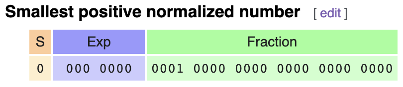

# COSC 326 Étude 12 - Floating Point

## About

**FloatingPoint.java** is the application class that prompts the user for the input and output filenames, and the precision of each file either single or double.

---

## Instructions

This program can be either be run through the terminal e.g. `java FloatingPoint.java` or by clicking `Run` in your chosen IDE.

**Note:** *You don't need to add the .bin file extension when prompted for the name of the input and output file*

---

## Binary Files

An example of an input .bin file. This file is being read in as single precision.

An example of an output .bin file. The file is written using double precision.

**Note:** *For any hexdecimal values that aren't 4 bytes or 8 bytes for single or double precision it's important to add leading zeros to pad the input.*

---

## Background

> IBM hexadecimal floating-point
 is a format for encoding floating-point numbers first introduced on the IBM System/360 computers, and supported on subsequent machines based on that architecture, as well as machines which were intended to be application-compatible with System/360.
> In comparison to IEEE 754 floating point, the HFP format has a longer significand, and a shorter exponent. All HFP formats have 7 bits of exponent with a bias of 64. The normalized range of representable numbers is from 16−65 to 1663 (approx. 5.39761 × 10−79 to 7.237005 × 1075). - [Wikipedia](https://en.wikipedia.org/wiki/IBM_hexadecimal_floating-point)

> IEEE 754 is a widely used standard for encoding floating-point numbers in computer systems. It was developed by the Institute of Electrical and Electronics Engineers (IEEE) and defines formats for representing both single-precision (32-bit) and double-precision (64-bit) floating-point numbers.
> In IEEE 754, the single-precision format uses 32 bits, while the double-precision format uses 64 bits. The number of bits allocated for the exponent and significand (also known as the mantissa) varies between the two formats.
> In the single-precision format, IEEE 754 allocates 1 bit for the sign of the number, 8 bits for the exponent, and 23 bits for the significand. The exponent is biased by 127, meaning that a bias of 127 is added to the actual exponent value to obtain the encoded exponent.
> For the double-precision format, IEEE 754 allocates 1 bit for the sign, 11 bits for the exponent, and 52 bits for the significand. The exponent bias in this case is 1023.
> The range of representable numbers in IEEE 754 depends on the exponent bias and the number of bits allocated for the significand. For single-precision, the normalized range is approximately from 1.4 × 10^(-45) to 3.4 × 10^38. For double-precision, the normalized range extends from approximately 4.9 × 10^(-324) to 1.8 × 10^308. - **ChatGPT**

The main difference between IBM and IEEE form is that while IBM usually has 7 bits reserved for the exponent and 24 for the fraction IEEE has 8 bits reserved for the exponent and 23 for the fraction. Of course this varies between single and double precision but the general concept is the same, IBM has less range and more precision while IEEE has more range and less precision.

---

## Implementation

Each byte of the binary file is read in from the file. These bytes are in its decimal form so firstly is converted to its binary representation. From there we can convert the binary value into its decimal value by using the following formula:

This decimal value can then be converted to its equivalent IEEE754. Java handles most of this by converting the float or double decimal value representing single and double precision respectively into its raw bits. These raw bits are then converted into the binary represenation of the IEEE754 standard form and outputted to a binary file.

--- 

## Testing

Manual testing was used to verify that the IBM hexadecimal floating point numbers were correctly converted to its IEEE standard form equivalent. Example of values that were tested were −118.625, +7.2370051 × 1075, 5.397605 × 10−79 and 0.0. The output of these files would then be tested using
[Base Convert](https://baseconvert.com/ieee-754-floating-point). The hexadecimal value in the binary file would be checked against the value on the site to see if it matched the decimal value at the very top.

--- 

### -118.625
Binary value of IBM floating point number

Converted binary value to hexadecimal

Hexadecimal value of IBM floating point

Hexdecimal value of IEEE single precision

Hexadecimal value of IEEE double precision

Converted hexdecimal value to decimal

---

### Largest representable number

Binary value of IBM floating point number

Converted binary value to hexadecimal

Hexadecimal value of IBM floating point

Hexdecimal value of IEEE single precision

Hexadecimal value of IEEE double precision

Converted hexdecimal value to decimal

---

### Smallest representable number

Binary value of IBM floating point number

Converted binary value to hexadecimal

Hexadecimal value of IBM floating point

Hexdecimal value of IEEE single precision

Hexadecimal value of IEEE double precision

Converted hexdecimal value to decimal

---

### Zero

Binary value of IBM floating point number

Converted binary value to hexadecimal

Hexadecimal value of IBM floating point

Hexdecimal value of IEEE single precision

Hexadecimal value of IEEE double precision

Converted hexdecimal value to decimal

---

