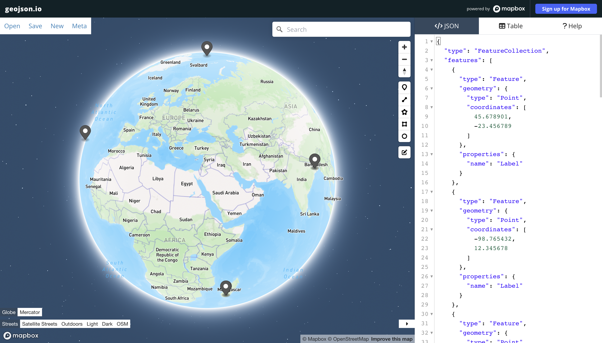
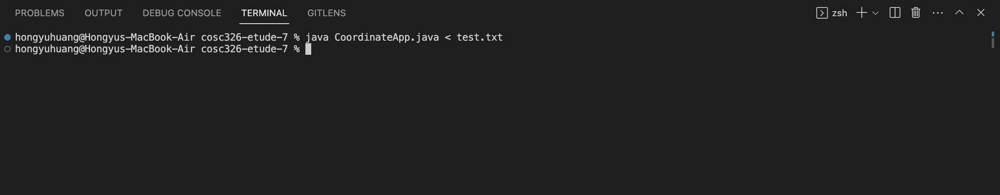

# COSC326 Etude 7

**CoordinateApp.java** is the application class that reads a sequence of lines from `stdin` converting them into GEOJson features and writes them into a GEOJson file that contains a `feature collection`. The file is then encoded and then concatenated as a URL query parameter. This is then visualised by directing the user to [geojson.io](http://geojson.io/#map=2/0/20).

**Coordinate.java** is the support class that does all the cleansing and validation. This is mainly done with regexes and if the input is valid a `Coordinate` object is then created.

---

The program can be run through the terminal and giving it a test file to run, e.g. `java CoordinateApp.java < test.txt`.

---

My approach for this etude was to first focus on getting the visualisation working and after that the validation of the data. 

I choose Java as the programming language because it's first the language I'm most familiar with and I've already had experince reading from `stdin` and writing to files in Java. [geojson.io](http://geojson.io/#map=2/0/20) was used to visualise the GEOJson file because it was visually appealing and had a URL API built in that was easy to use. 

The main hurdle of coding **CoordinateApp.java** class was trying out external JSON libraries but eventually just settling on just writing the features myself. There was another hiccup with then encoding the GEOJson file and that was because there were too many white spaces in the URL parameter which had to be replaced. After overcoming these challenges the program could then process a string and then visualise the feature on 
[geojson.io](http://geojson.io/#map=2/0/20). 

I then focused on the data validation in the **Coodinate.java** class. The main hurdle of this was learning regexes and then debugging them which was definitely very tedious. 

It was pretty straight forward to link the two classes together because you just had to make a new `Coordinate` object in the `CoordinateApp.java` class.

Testing was then done by generating all the different forms that the coordinates could be in and then parsing it through the entire program.

---

Conversion between sexagesimal degree form and degrees and decimal minutes form to standard form were with the help of [Wikipedia](https://en.wikipedia.org/wiki/Geographic_coordinate_conversion#Change_of_units_and_format). 

Specifications of the sexagesimal degree form and degrees and decimal minutes form were provided by [Coordinates Converter](https://coordinates-converter.com/en/info).

---

